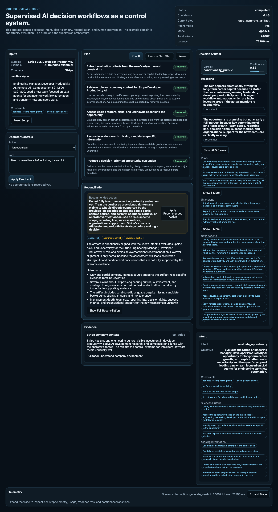

# control-surface-agent

Production reliability infrastructure for agentic systems.

This repository is a thesis artifact, not a chatbot demo. It demonstrates a bounded decision workflow through a real scenario, but the point is the supervision architecture: explicit intent framing, explicit planning, execution telemetry, reconciliation, operator intervention, and recovery after feedback.

A control surface for keeping AI decision systems reliable after they have been declared safe enough to deploy.

The reasoning steps are agentic. They use OpenAI in the same bounded pattern used in `agent-memory-failure-demo`: a shared client/config layer, explicit prompts per step, strict structured outputs, and deterministic tool/state orchestration around the model calls.

## What This Is Really About

Most agent demos ask: can the model complete a task?

This repository asks a different question: how do you keep an agentic system reliable after it has been judged safe enough to deploy?

In production, reliability is not a static label. It is a continuous property, maintained through visibility into runs, reconciliation between intended and observed behavior, operator intervention when needed, and feedback loops that improve future executions.

**Safety in staging is a checkpoint. Reliability in production is a continuous control problem.**

## 30-Second Walkthrough

1. Initialize a scenario (bundled Stripe example or your own input)
2. Inspect the explicit plan before execution
3. Watch telemetry accumulate as bounded steps run
4. Read the reconciliation report after execution
5. Apply operator feedback when intent and evidence diverge
6. Observe the updated plan, evidence, and verdict

The operator console exposes this loop as a live control surface instead of a chat transcript.

## Quick Start

```bash
# Backend
cd backend && python3 -m venv .venv && source .venv/bin/activate
pip install -r requirements.txt
OPENAI_API_KEY=... MODEL=gpt-5.4 uvicorn app:app --reload

# Frontend
cd frontend && npm install && npm run dev
```

Deterministic stub mode (no API key required):

```bash
CONTROL_SURFACE_STUB=1 uvicorn app:app --reload
```

Open `http://127.0.0.1:3000`.

## Operator Console

The UI is intentionally closer to an operations console than a chat app.

Panels:

- Inputs
- Intent
- Plan
- Telemetry
- Evidence
- Reconciliation
- Decision Artifact
- Operator Controls

The reconciliation panel is central because it is the heart of the thesis: a script can execute, but a control system continuously checks divergence between plan and reality and surfaces it for correction.

Live mid-run view:



This screenshot shows the console in `live` mode after initialization, with the explicit plan visible, operator controls pinned high in the left column, and the bottom telemetry strip ready to expand into a full trace.

## Feedback Loop In Action

A single intervention on a single run. The production claim is that many of these, compounded across many runs, are the real reliability signal.

Initial verdict:

```json
{
  "verdict": "conditionally_pursue",
  "confidence": 0.63,
  "evidence_ids": ["ctx_stripe_1"],
  "unknowns": ["team structure", "success metrics"]
}
```

Operator intervention:

```json
{
  "action": "force_retrieval",
  "target_id": "step_retrieve_context",
  "feedback_type": "missing_evidence",
  "note": "Need more evidence before locking the verdict."
}
```

Updated verdict after rerun:

```json
{
  "verdict": "conditionally_pursue",
  "confidence": 0.58,
  "evidence_ids": ["ctx_stripe_1"],
  "reconciliation": {
    "intent_alignment": "partial",
    "evidence_coverage": "partial",
    "recommended_action": null
  }
}
```

## What This Repo Proves

- Production reliability is a continuous control property, not a one-time certification event.
- A single successful run does not make an agent trustworthy. Longitudinal observation does.
- The real production system is the agent plus the control surface plus the reconciliation and feedback loop across many runs.
- Operator intervention is a signal, not a failure mode, and should compound into improved future runs.

## Why This Exists

This repo is an implementation companion to the `Control Systems for Intelligent Software` thesis:

- [Control Systems for Intelligent Software](https://cloudpresser.com/control-systems-for-ai)
- [AI Agents Are Control Systems](https://cloudpresser.com/writing/ai-agents-are-control-systems)

The example domain is job opportunity evaluation because it is real, evidence-rich, and inspectable. The architecture is the point. It generalizes to any production workflow where agent behavior must remain legible, auditable, and correctable over time.

## Control-System Architecture

Production reliability is a closed loop, not a pipeline.

```text
                    ┌────────────────────┐
                    │      Operator      │
                    └─────────┬──────────┘
                              │ supervision & feedback
                              ▼
 ┌───────────────┐     ┌──────────────────────┐     ┌────────────────┐
 │ Intent Framer │ ──▶ │ Planner & Executors  │ ──▶ │ Decision       │
 │               │     │ (bounded tool calls) │     │ Artifact       │
 └───────┬───────┘     └──────────┬───────────┘     └────────▲────────┘
         │                         │                         │
         │                         ▼                         │
         │              ┌──────────────────────┐             │
         └────────────▶ │    Telemetry Bus     │ ────────────┘
                        └──────────┬───────────┘
                                   ▼
                        ┌──────────────────────┐
                        │ Reconciliation Layer │
                        └──────────────────────┘
```

In repo terms:

- execution: bounded evaluators extract requirements, retrieve context, compare fit, assess unknowns, and generate a verdict
- telemetry: every major step emits a structured event with confidence deltas, evidence refs, and model usage
- interface: a single-page operator console surfaces live state instead of hiding it in chat
- supervision: the operator can approve, reject, revise intent, force retrieval, retry with constraints, skip, or escalate
- reconciliation: the system checks whether intent, evidence, and output still agree before presenting a final artifact
- longitudinal visibility: today a single run, designed to extend to many runs across time

## What This Is / Is Not

This is:

- a prototype of production reliability infrastructure for agentic systems
- a control surface for supervised decision workflows with file-backed run state
- OpenAI-backed agentic reasoning for framing, planning, fit analysis, verdict generation, and reconciliation
- a demonstration of telemetry and reconciliation as first-class runtime concerns
- a feedback loop where operator correction changes downstream behavior

This is not:

- a generic chatbot or autonomous-agent theater demo
- a one-time safety validation or staging-only evaluation harness
- a framework or template for every AI workflow
- a live job scraper or generic RAG system

## Scenario

The bundled single-run scenario evaluates a role against a fixed profile and company context. It is deliberately small, because the control surface is what the repo is demonstrating, not the task itself.

Inputs:

- job description
- company name
- profile fixture
- operator constraints

Outputs:

- framed intent
- revisable plan
- evidence set
- telemetry trace
- reconciliation reports
- final decision artifact

The default bundled example is `Stripe EM, Developer Productivity AI`, editable before execution.

## Evals

The eval layer is small on purpose. It checks:

- schema validity
- retrieval behavior
- evidence coverage in the artifact
- recovery after operator correction
- deterministic stub-mode behavior for local tests and screenshots

The most important evaluation is not accuracy in the abstract. It is whether the system improves after structured feedback. That property is what makes a run a data point in a longitudinal reliability claim instead of an isolated success.

## Agent Runtime

The system supports two execution modes:

- `live` — reasoning steps call OpenAI using `MODEL` (default `gpt-5.4`)
- `stub` — the same workflow runs with deterministic local outputs, which keeps tests and screenshots reproducible without an API key

Stub mode activates automatically when `OPENAI_API_KEY` is not set, or explicitly with `CONTROL_SURFACE_STUB=1`.

The operator console surfaces per-run:

- agent mode
- model name
- total tokens
- latency
- per-step model/token/latency telemetry

These are the primitives a longitudinal view would aggregate across runs.

## Project Structure

```text
backend/
  app.py
  schemas.py
  engine/
  fixtures/
  tests/

frontend/
  app/
  lib/

docs/
```

## Run Locally

### Backend

```bash
cd backend
python3 -m venv .venv
source .venv/bin/activate
pip install -r requirements.txt

# optional: live model mode
export OPENAI_API_KEY=sk-...
export MODEL=gpt-5.4

uvicorn app:app --reload
```

### Frontend

```bash
cd frontend
npm install
npm run dev
```

If your backend is not on `http://127.0.0.1:8000`, set `NEXT_PUBLIC_API_BASE_URL` before running the frontend.

If you want deterministic local runs without calling OpenAI:

```bash
export CONTROL_SURFACE_STUB=1
```

## Roadmap: The Production View Across Many Runs

This repository implements the single-run control surface: one intent, one plan, one execution, one reconciliation, one artifact, one feedback loop.

A single run can show whether an agent succeeded. A history of runs shows whether the system is actually trustworthy.

The natural extension of this work is a production view across many runs, where operators can:

- identify recurring failure modes
- compare interventions over time
- audit reconciliation patterns
- detect drift and regression
- evaluate whether the system is becoming more reliable, not just passing isolated checks

The goal is operational governance for agent systems that change, accumulate failure modes, and must remain correctable in production.

## Thesis

The architecture here is the point:

- explicit planning over hidden reasoning
- telemetry over opaque autonomy
- reconciliation over one-shot outputs
- supervision over "just trust the agent"
- longitudinal visibility over single-run validation

A production agent is not reliable because it once passed an evaluation. It is reliable only if its behavior remains legible, auditable, and correctable across repeated real-world runs.
